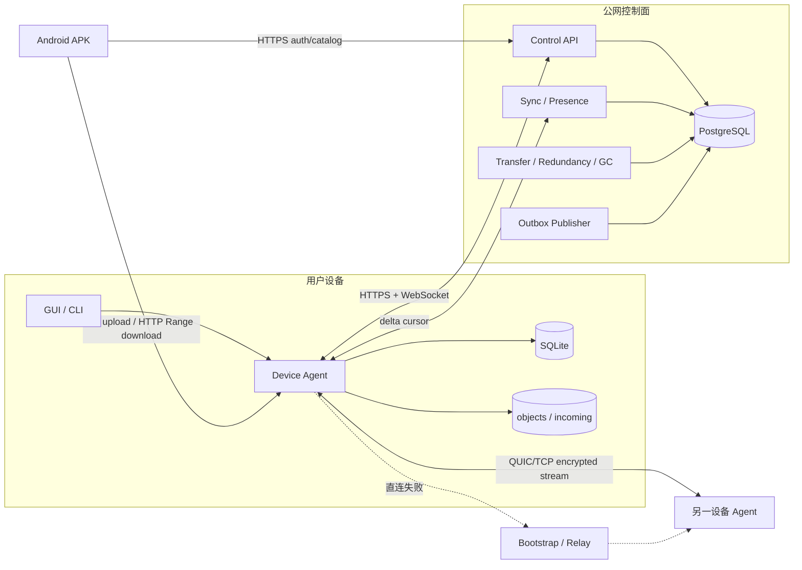

# 个人分布式云盘系统：架构设计方案

版本：v1.3-lan
架构状态：LAN V1 已批准实现；公网、Relay 与多源仍待后续原型门禁

## 1. 架构驱动因素

- 文件正文不落中心服务器，控制面与数据面彻底分离。
- LAN V1 先闭环 Android 与 Ubuntu 的流式上传、范围下载、断点恢复和完整性校验；换源推迟到后续阶段。
- 同一账号多设备最终一致，但目录和任务写入必须有单一权威源。
- Android SAF、可见传输和进程重建是 LAN V1 的正常环境；NAT、运营商网络和 Relay 推迟到后续阶段。
- 首版由小团队维护，应优先模块化单体和成熟协议，避免过早拆微服务。
- 安全边界以账号、设备密钥、短时授权三者共同约束。
- 服务器必须以不可变 OCI 镜像交付，在 Docker 中以非 root、无本地权威状态的进程运行，并能通过探针、信号和外部配置被编排。

## 2. 方案比较

| 方案 | 产品匹配 | 开发/维护 | 安全与可测性 | 结论 |
|---|---|---|---|---|
| 直接部署 Syncthing 并包装 UI | 同步文件夹成熟，但不天然提供统一逻辑目录、按需副本、账号控制面和 7 天逻辑回收站 | 初期快，后续语义改造重 | 数据协议成熟，但产品模型错位 | 作为协议和故障处理参考，不作为产品内核 |
| Headscale/Tailscale 类覆盖网 + 自定义传输 | 网络连通简单 | 用户设备需额外网络组件，移动端和分发受约束 | 降低 NAT 难度，但产生较强部署依赖 | 开发环境/应急通道可选，不作为 V1 默认 |
| 自定义控制面 + go-libp2p 数据面 | 与逻辑目录、按需副本、授权模型高度匹配 | 需要实现任务和数据协议；libp2p 承担 NAT/Relay/安全传输 | 边界明确，可做端到端故障注入 | 采用 |
| 从零实现发现、NAT 穿透、Relay、加密 | 可完全定制 | 成本和安全风险最高 | 难以证明正确 | 拒绝 |

LAN V1 数据面比较：

| 方案 | Android 适配 | 恢复与完整性 | 对现有架构影响 | 结论 |
|---|---|---|---|---|
| Android 嵌入 Go/libp2p | 需要 gomobile、NDK、生命周期和后台常驻桥接 | 可复用未来 P2P 协议，但当前正文循环未实现 | 原型和发布风险最高 | 后续公网/P2P 阶段使用，不阻塞 LAN V1 |
| 自定义分块 REST 协议 | 客户端容易起步 | 需自行证明偏移、重放、并发和代理语义 | 会产生第二套私有传输状态机 | 拒绝 |
| tus 1.0 上传 + HTTP Range 下载 | 有官方 Java/Android 客户端；协议与 HTTP 基础设施成熟 | 标准偏移恢复；完成后继续使用既有 SHA-256/原子落盘 | 只给 Agent 增加显式启用的 LAN API | LAN V1 采用 |

LAN V1 设备发现比较：

| 方案 | 兼容性与维护 | 安全边界 | 结论 |
|---|---|---|---|
| 手工输入地址 | 所有网络可用，但首次配置易错 | 地址由用户明确确认 | 永久保留为回退路径 |
| Android NSD + DNS-SD/mDNS | Android 原生支持；Ubuntu 可与 Avahi/Bonjour 互通 | 广播仅给出候选地址，Token/TLS 仍负责认证与保密 | 采用 `_sharedisk._tcp` |
| 私有 UDP 广播/网段扫描 | 需自定义报文、权限、重试和兼容策略 | 易扩大扫描面且协议难演进 | 拒绝 |
| 使用公网控制面返回局域网地址 | 不能解决控制面离线和多网卡可达性 | 可能接受过期或错误地址 | 后续可作提示，不作为 LAN 发现基础 |

部署方式比较：

| 方案 | 可复现性与隔离 | 运维成本 | 迁移能力 | 结论 |
|---|---|---|---|---|
| 宿主机直接安装二进制和 PostgreSQL | 依赖宿主机状态，升级/回滚难复现 | 初期少文件，长期易漂移 | 与主机服务管理强绑定 | 仅允许开发调试，不作为交付方式 |
| Docker Compose + 模块化单体 | 镜像、网络、健康依赖和卷边界明确 | 适合 V1 单机自托管 | 同一镜像和运行契约可迁移到编排平台 | 采用，作为 V1 生产与 E2E 基线 |
| 立即 Kubernetes/Service Mesh/微服务化 | 能力完整但当前没有规模、团队或隔离证据 | 配置面和故障面显著增加 | 强，但超出 V1 所需 | 保留兼容性，不在 V1 强制交付 |

## 3. 总体决策

采用“Docker 模块化控制服务 + 每设备 Agent + PostgreSQL/SQLite 双元数据层”的总体架构。LAN V1 使用 tus/HTTP Range 数据面；go-libp2p 保留给后续公网、Relay 和多源阶段，不能阻塞首个可运行产品。

- 服务端：单个可水平扩展的 Go 模块化单体；PostgreSQL 是账号、逻辑目录、设备声明、任务和事件日志的权威源。
- 交付：服务器代码只以职责单一的 OCI 镜像进入生产；V1 用 Docker Compose 编排，`control-server`、`control-worker`、迁移任务和 Relay 使用独立容器，但继续共享同一代码库和领域模型。
- Agent：每设备一个进程；SQLite 是本地对象、分块进度、待同步操作和服务端缓存的本地权威源。
- LAN V1 数据面：Android 直连 Ubuntu Agent；tus 1.0 负责可恢复上传，标准 HTTP Range 负责可恢复下载，完成对象仍由 Agent 计算 SHA-256 并原子进入对象区。
- LAN V1 发现：Agent 在显式启用时通过 DNS-SD/mDNS 发布 `_sharedisk._tcp.local.` 和非敏感能力 TXT；Android 用系统 `NsdManager` 浏览、解析并让用户选择。发现不携带 Token、账号或文件信息，连接后仍执行现有认证。
- 后续数据面：go-libp2p QUIC/TCP、Noise/TLS、AutoNAT、hole punching、Circuit Relay v2；必须复用相同对象、授权和校验语义。
- 控制 API：`net/http` + `chi`，OpenAPI 3.1 作为契约；数据访问使用显式 SQL，拒绝重量 ORM（驱动选型见 ADR-005 修订）。
- 事件：事务 outbox + 账号内单调序号；WebSocket 只通知，Agent 通过游标补拉。
- 界面：LAN V1 只交付原生 Android APK 和 Ubuntu CLI；Android 使用 SAF，不嵌入 Go 运行时。桌面 GUI、Windows 和共享 Go UI 均冻结。

## 4. 逻辑组件

## 5. 模块边界与所有权

| 模块 | 拥有的数据/规则 | 不得承担 |
|---|---|---|
| `identity` | 用户、会话、设备公钥、撤销 | 文件授权和传输实现 |
| `catalog` | folder、file object、file entry、路径唯一性 | 本地绝对路径 |
| `replica` | 副本声明、验证状态、冗余缺口 | 网络连接细节 |
| `transfer` | 任务、授权票据、任务状态转换 | 直接保存文件正文 |
| `trash` | 删除、恢复、tombstone、GC 可达性 | 绕过对象引用计数 |
| `sync` | 事件序号、补拉、客户端游标 | 把 WebSocket 当持久队列 |
| Agent `storage` | 对象路径、原子落盘、磁盘回收 | 逻辑目录权威 |
| Agent `p2p` | Peer 连接、流、多地址和路径观测 | 决定账号业务权限 |
| Agent `lanapi` | tus 会话、Range 下载、READY 对象发布、请求限额 | 签发账号凭据、保存逻辑目录权威状态 |
| Android APK | SAF URI、可见进度、断点状态、最终 Hash 校验 | 访问 Ubuntu 绝对路径或绕过 Control Server 登录 |

模块只能通过应用服务接口或领域事件协作，不允许跨模块直接修改对方表。

## 6. 部署架构

### 6.1 容器职责与持久化边界

- `control-server`：无状态 HTTP/WebSocket 容器；不挂载数据卷，只读取配置和机密。
- `control-worker`：任务扫描、outbox、冗余和 GC 容器；与 server 使用相同领域代码，通过数据库租约协调，不依赖本地文件锁。
- `db-migrate`：使用同版本迁移资产的一次性容器；成功退出后 server/worker 才能进入 ready，失败时发布停止。
- PostgreSQL：唯一持久服务端状态，使用命名卷或明确的宿主机卷，并纳入备份/恢复演练。
- `relay-bootstrap`：M6 引入的独立容器和端口/资源配额；不挂载正文卷，不与业务 HTTP 共享流量限制。
- 反向代理：唯一公网 HTTP 入口，负责 TLS、请求体上限和连接超时；文件正文不得经过控制 API。具体产品选型在 M3 前关闭开放项。

### 6.2 Docker Compose 单机拓扑

Compose 项目至少包含 PostgreSQL、一次性迁移、server、worker；Relay 和反向代理按里程碑加入。启动依赖是 `postgres healthy -> db-migrate completed -> server/worker ready`，不能只依赖容器启动顺序。只有 PostgreSQL 声明持久卷；应用网络与入口网络分离，数据库端口默认不发布到公网。

应用镜像采用多阶段构建，生产层只含二进制和运行必需的 CA 证书；每个容器一个主进程、固定非 root UID/GID、只读根文件系统、`/tmp` 使用受限 tmpfs、删除 Linux capabilities、禁止 privileged 和 Docker socket。镜像写入版本、提交和构建时间元数据；发布标签不可变，生产基线最终锁定基础镜像摘要。

配置使用环境变量，机密使用只读 secret 文件和 `*_FILE` 入口；开发 `.env` 只允许保存非机密默认值。日志写 stdout/stderr，指标由内部运维网络抓取。server/worker 接收 `SIGTERM` 后停止接入、取消任务、等待 owner 收尾，并在 Compose 宽限期内退出。

### 6.3 探针、发布与迁移

- `/livez` 只反映进程事件循环，不访问外部依赖；失败由容器运行时重启。
- `/readyz` 有短超时，至少检查 PostgreSQL 连通、迁移版本和本进程关键循环；失败时停止接流量但不触发重启风暴。
- 镜像构建、SBOM、漏洞扫描、Compose 配置校验和容器 E2E 是 CI 发布门禁；扫描例外必须有 owner、期限和风险说明。
- 数据库变更按 expand/migrate/contract 前向演进。一次发布先备份，再运行单实例迁移任务，再滚动替换兼容旧 schema 的应用镜像；禁止应用副本各自启动迁移。
- 回滚优先恢复上一不可变镜像；数据库不自动 down migration，必要时以前向修复恢复兼容。

### 6.4 横向扩展与编排迁移

- server 可横向扩展；presence 以短 TTL 数据为主，权威设备状态仍可重建。
- worker 使用数据库租约/行锁抢占任务；每个任务同一时刻仅一个 owner。
- WebSocket 可连接任一 server；通知丢失由 delta sync 修复，因此不要求粘性会话。
- Relay 独立扩容并限制每账号、每连接、每小时字节数。
- Docker Compose 是 V1 交付基线，不把 Compose 特有行为写入领域层。未来迁移 Kubernetes 时沿用同一镜像、端口、探针、信号、配置、secret 和无状态约束，再新增 Deployment/Job/Service/Ingress，不借迁移之名拆分业务模块。

## 7. 数据与一致性

### 7.1 权威源

- PostgreSQL：逻辑目录、FileEntry、Replica 声明、TransferTask、Trash/Tombstone、策略、账号事件序号。
- SQLite：本地对象是否实际存在、块位图、临时文件、等待上报的本地结果。
- 文件系统：文件正文字节的最终事实；SQLite 记录必须可通过扫描和 Hash 重建。

### 7.2 写事务规则

- 目录写、导入登记、创建副本任务、删除/恢复均在单个 PostgreSQL 事务中完成业务写、幂等结果和 outbox 事件。
- 同一目录的命名冲突依赖数据库唯一约束，不依赖“先查后写”。
- 任务领取使用短租约；状态更新携带 `version` 做乐观并发控制。
- 涉及同一对象的冗余、删除和 GC，先锁 `file_objects` 行，再按固定顺序访问引用、副本和任务，降低死锁风险。
- 事务重试只针对明确可重试的序列化失败/死锁；重试次数有上限且保持同一幂等键。

### 7.3 事件交付

1. 业务事务写入 `account_events(account_id, seq, type, payload)`。
2. WebSocket 发布器发送“最新可用序号”提示，不承诺逐条可靠投递。
3. Agent 调用 `/v1/sync?after=<seq>&limit=N` 拉取并按序应用。
4. Agent 在本地事务中应用事件并推进 cursor；重复序号直接忽略。
5. 事件保留窗口结束前，服务端确认所有活跃设备 cursor；超窗设备执行全量快照同步。

## 8. 关键数据流

### 8.1 导入

`source -> incoming 临时文件 -> 流式 Hash -> fsync -> 原子重命名 objects/hash -> SQLite READY -> 服务端幂等登记 -> account event`

若服务端登记失败，本地对象保留为 `PENDING_REGISTER`，后台重试；不得在服务端确认前声称其他设备可见。

LAN V1 的 Android 上传由 Agent 的 tus endpoint 接收。未完成内容只存在于受管 `incoming` 区和持久上传状态中；完成回调关闭临时写入后，Agent 通过既有对象导入路径计算 SHA-256、原子发布 READY，并创建显示名记录。上传响应只有在 SQLite 与对象文件均提交成功后才暴露文件条目。

### 8.2 下载/推送/冗余

三者共用一个 `TransferTask`：发起原因不同，数据接收方始终为任务执行者。目标设备领取任务、取得短时票据、连接候选源、按块写入、完整校验、原子落盘、上报 READY。

LAN V1 下载先采用单 Ubuntu 源：Android 从文件目录取得对象 ID、大小和 SHA-256，通过 Agent 的条件/Range GET 流式写入 SAF URI；进程重建后根据已写字节继续请求，完成后本地计算 SHA-256。服务端声明、响应 ETag 与本地结果任一不一致都不得显示成功。后续 P2P 实现必须保持这一完成判定。

### 8.3 删除

`ACTIVE -> TRASHED -> PURGING -> tombstone 下发 -> 副本确认/设备注销 -> 对象无引用 -> 本地 GC`。任何一步均可重试且不得从旧 Replica 上报恢复逻辑文件。

LAN V1 先在 Agent 本地目录实现同一不变量：重命名只更新逻辑名称；删除设置 `TRASHED` 与 `purge_after`；恢复先检查活动名称冲突；永久删除先进入 `PURGING`。只有最后一个逻辑引用进入永久删除时才移除对象正文，进程在正文删除与 SQLite 提交之间退出后可由同一永久删除请求或启动修复收敛。

## 9. 安全架构

- 密码：Argon2id；参数在部署硬件上以目标延迟和内存基线校准，编码到哈希字符串以便升级。
- 会话：短期 Access Token；随机 Refresh Token 仅存哈希，轮换并检测重放；设备注销撤销会话族。
- 设备：首次安装生成 Ed25519 身份密钥，服务端绑定 `device_id/public_key/peer_id`。
- 传输票据：服务端 Ed25519 签名，声明账号、对象、源、目标、权限、期限、`jti`；源端还必须校验远端 PeerID 与目标设备公钥绑定。
- LAN V1：Agent 复用 Control Server 的短期 Access Token 验证器，只接受预期签名算法、有效期和账号 claims；LAN API 默认关闭且默认绑定回环地址，显式开启时必须配置允许的账号和请求大小。生产 LAN 使用受信 TLS 入口，明文只允许隔离测试配置。
- 本地 API：Linux 使用权限受限 Unix socket，Windows 使用命名管道，Android 进程内调用；不得默认监听公网网卡。
- 路径：逻辑路径解析后再映射对象；永不拼接用户输入到本地对象绝对路径。
- Relay：连接、时长、字节和并发限额；业务内容仍是端到端加密流。
- 日志：Token、票据、密码、绝对路径和文件名默认脱敏；仅记录对象 Hash 前缀用于排障。
- 容器：固定非 root 身份、只读根文件系统、最小 capabilities；不得挂载宿主机根目录、Docker socket、Agent 对象目录或其他跨边界路径。

libp2p 提供加密认证通道，但官方也明确指出应用仍需处理授权、资源滥用等业务安全问题，因此不得把“连接已加密”等同于“允许读文件”。

## 10. 可观测性与运维

- 日志公共字段：`timestamp, level, service, version, account_id_hash, device_id, task_id, trace_id, path_type, error_code`。
- 指标：API 延迟/错误、在线设备、同步滞后、任务状态、传输字节/速度、校验失败、切源、Relay 比例、GC backlog、outbox lag。
- 健康检查：`/livez` 仅进程；`/readyz` 检查数据库、迁移版本和关键后台循环；`/metrics` 仅运维网络可见。
- 追踪：控制面使用 W3C trace context；P2P 握手携带 task/trace 关联值但不携带长期凭据。
- 备份：PostgreSQL 定期备份与恢复演练；Agent 对象不由服务器备份，副本风险由 UI 明示。
- 容器观测：镜像版本/提交作为低基数资源属性；容器退出原因、重启次数、健康状态和资源上限纳入部署监控。

## 11. 失败与恢复策略

- 控制服务断开：Agent 指数退避并带抖动；本地访问正常；持久结果排队上报。
- WebSocket 丢消息：游标补拉，不靠无限重连修复。
- 源掉线：保存块位图，选择另一个 READY 源；无源时进入 `WAITING_SOURCE`。
- 目标空间不足：开始前预留 `remaining_bytes + safety_margin`；中途 ENOSPC 保留可恢复临时文件并停止重试风暴。
- Agent 崩溃：启动时核对 `.part`、块位图和对象，恢复或隔离不一致状态。
- Hash 失败：删除/隔离临时对象、将源副本降级为待复核，不把单次网络损坏直接判成源永久 CORRUPT。
- worker 崩溃：租约过期后其他 worker 领取；所有完成回调幂等。
- PostgreSQL 未就绪或迁移失败：应用保持 not ready，Compose 不越过迁移门禁；不得通过无限重启掩盖不可重试的配置/迁移错误。
- 容器收到 `SIGTERM`：server 先停止接入再等待在途请求，worker 停止领取并释放/等待租约；超过宽限期才允许强制终止。

## 12. 主要架构决策（ADR 摘要）

- ADR-001：控制面模块化单体，不拆微服务；当独立扩缩、故障隔离和团队边界同时出现证据时再拆。
- ADR-002：采用 go-libp2p，不自研 NAT/Relay/安全传输。
- ADR-003：WebSocket 是提示通道，数据库事件日志和游标同步才是可靠机制。
- ADR-004：文件对象和逻辑目录分离；对象账号内内容寻址。
- ADR-005：数据访问采用显式 SQL/迁移，避免 ORM 隐藏锁和约束。**修订（2026-08）**：当前代码基线实际使用 `database/sql + lib/pq`。鉴于 `lib/pq` 处于维护模式，本决策改为“逐步统一到 `pgx/v5`”：后续新增/改造的 PostgreSQL 仓储使用 pgx，迁移完成前不新增基于 `lib/pq` 的批量、通知或类型敏感逻辑。迁移与替换以受控方式推进，不影响已批准的事务、锁与约束边界。
- ADR-006：桌面 Fyne；Android UI/后台集成以 Stage 0 原型结果为门禁，不强行共享全部界面代码。
- ADR-007：P2P 应用协议使用版本化 Protocol Buffers；HTTP 使用 OpenAPI JSON。
- ADR-008：不新增 Redis、Kafka、对象存储；已有 PostgreSQL 足以承担 V1 事件和租约。
- ADR-009：服务器强制 OCI 镜像交付，Docker Compose 是 V1 单机生产/E2E 基线；保持 Kubernetes 可迁移运行契约，但不提前引入集群或微服务复杂度。
- ADR-010：LAN V1 的 Android↔Ubuntu 数据面采用 tus 1.0 Creation/Core 上传和 HTTP Range 下载；Agent 复用 SQLite/对象区，不把正文写入 Docker 控制面。go-libp2p 仅在 LAN V1 门禁通过后恢复开发。
- ADR-011：Android 使用原生 SDK + SAF，LAN V1 侧载 APK；不嵌入 Go/NDK，不申请全盘存储权限，不实现隐藏常驻服务。
- ADR-012：LAN V1 设备发现采用标准 DNS-SD/mDNS；Android 使用 `NsdManager`，Agent 使用依赖树中维护的 `github.com/libp2p/zeroconf/v2`。发现仅提供候选地址，手工配置始终保留。
- ADR-013：LAN V1 文件重命名与回收站由 Agent SQLite 持有；逻辑条目与内容寻址对象分离，永久删除按对象引用数决定是否回收正文，不把此本地闭环误称为跨设备 tombstone 完成。

## 13. 验证、发布与回滚

- 架构原型门禁：两 Agent libp2p、Relay 配额、Android SAF/后台、SQLite 崩溃恢复、PostgreSQL 并发任务领取。
- 数据库迁移遵循 expand/migrate/contract；应用启动只检查版本，不在生产启动时自动执行破坏性迁移。
- API/协议先兼容旧读者，再删除字段；Protocol Buffers 字段号永久保留，不复用。
- 发布采用 server 向后兼容旧 Agent；Agent 滚动升级；出现问题先回滚二进制，数据库只做前向修复。
- 每阶段必须保留可复现测试和固定参数结果，外部 NAT/Android 真机验证不得用 mock 代替。
- 容器发布必须验证镜像可追溯、非 root/只读运行、Compose 启停、探针、`SIGTERM`、应用容器重建、迁移失败阻断和 PostgreSQL 卷恢复；只通过 `docker compose config` 不等于部署成功。

## 14. 官方技术依据

- [libp2p Hole Punching](https://docs.libp2p.io/concepts/hole-punching/)：AutoNAT、AutoRelay、Circuit Relay 和打洞流程。
- [libp2p Noise](https://docs.libp2p.io/concepts/secure-comm/noise/)：加密通道与前向保密。
- [libp2p Security Considerations](https://docs.libp2p.io/concepts/security/security-considerations/)：框架安全能力不替代应用层安全设计。
- [Syncthing Block Exchange Protocol](https://docs.syncthing.net/specs/bep-v1.html)：成熟的分块、认证和缺失块交换参考。
- [Android data transfer background task options](https://developer.android.com/develop/background-work/background-tasks/data-transfer-options)：用户发起传输、WorkManager 和前台服务的适用边界。
- [Android Network service discovery](https://developer.android.com/develop/connectivity/wifi/use-nsd)：Android DNS-SD 服务发现、解析和注销回调。
- [RFC 6762](https://www.rfc-editor.org/rfc/rfc6762) 与 [RFC 6763](https://www.rfc-editor.org/rfc/rfc6763)：mDNS 与 DNS-Based Service Discovery 标准。
- [tus 1.0 protocol](https://tus.io/protocols/resumable-upload)：Creation/Core 上传偏移、恢复和错误语义。
- [tus Android client](https://github.com/tus/tus-android-client)：Android SAF 输入与 tus Java 客户端集成基础。
- [Fyne Mobile Packaging](https://docs.fyne.io/started/mobile.html)：Android 打包能力与 SDK/NDK 前提。
- [PostgreSQL Explicit Locking](https://www.postgresql.org/docs/current/explicit-locking.html)：行锁、死锁和固定锁顺序。
- [SQLite WAL](https://www.sqlite.org/wal.html)：本地并发、checkpoint 和单写者约束。
- [OpenAPI Specification](https://spec.openapis.org/oas/) 与 [Protocol Buffers proto3 guide](https://protobuf.dev/programming-guides/proto3/)：接口与协议演进规则。
- [Docker Build best practices](https://docs.docker.com/build/building/best-practices/)：多阶段构建、基础镜像更新和构建上下文原则。
- [Docker Compose startup order](https://docs.docker.com/compose/how-tos/startup-order/)：依赖健康和一次性任务完成条件。
- [Docker Compose secrets](https://docs.docker.com/compose/how-tos/use-secrets/)：运行时机密文件注入边界。

结论：`APPROVED_FOR_IMPLEMENTATION`
