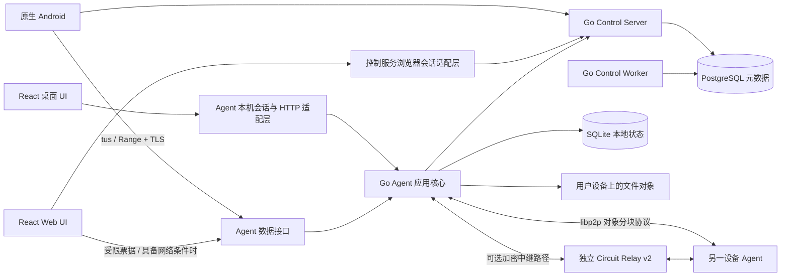

# Share Disk 客户端与服务端工程架构、开发规范及验收基线

版本：1.2；制定日期：2026-09-10；最近实施更新：2026-09-11；起始代码审查基线：`a575213`（`ui-v1`）。

本文用于指导 UI/UE 初步建设后的实质开发。文中的“采用”“必须”“验收”是工程要求；具体完成状态以本节实施快照和测试证据为准。版本与平台约束参考文末官方资料，依赖最终以经过构建验证的锁文件为准。

## 1. 总体决策与交付边界

采用 **Go 模块化单体控制服务 + Go 跨平台设备 Agent + libp2p 原生设备传输目标 + HTTP 客户端接入 + React 共享 Web/桌面界面 + Kotlin/Compose 原生 Android + PostgreSQL/SQLite**。文件持久副本保留在用户设备，控制服务只保存账户、目录、设备、副本、任务和同步事件等元数据。可选 Relay 转发加密流量，不持久保存文件，也不把文件中转职责并入 Control Server。

项目处于初级阶段，**先纠正会随业务增长而固化的架构，再扩展真实业务**。保留 Go/React/原生 Android 的技术方向与 UI/UE 设计成果，不把现有目录、接口、数据库字段和大类实现视为必须维持的约束。共享核心、设备身份、传输协议无关模型、客户端状态层均前置到 E0；libp2p 在 E0 完成实传验证并作出采用结论，避免拖到公网功能开发时才发现根基不兼容。

本轮文档覆盖环境、技术栈、进程与模块架构、协议、数据一致性、开发规范、质量门禁、迁移顺序及验收指标。后续代码按本文里程碑实施，不把全部远期功能挤入首个版本。

### 1.1 产品阶段

| 阶段 | 必须交付 | 暂不作为该阶段承诺 |
| --- | --- | --- |
| 架构基础与验证 | 共享 Agent、真实设备密钥、协议无关任务模型、统一 UI/状态框架；两 Agent 的 libp2p 实传/续传/受控 Relay 原型 | 原型通过不等于公网产品已交付 |
| LAN 基础闭环 | 单账户、一个 Ubuntu 存储 Agent、Android 上传/下载、目录、回收站；真实登录、续传、哈希校验、安装升级；对选定传输执行回归 | 公网访问、跨账户分享、自动冗余、所有 NAT 均可穿透 |
| 统一客户端版本 | Windows 与 Ubuntu 共用核心和 React UI；Android 与 Web 使用同一控制契约；同账户多设备目录与显式副本任务 | 自动副本修复、任意浏览器持久后台传输 |
| 扩展版本 | 按独立里程碑验收分享、自动冗余、事件推送、公网直连或 Relay | 未经过专项验收的“完整分布式云盘”声明 |

首版仍采用窄 LAN 产品验收边界，但验证架构需要提前使用两个 Agent 和受控公网/Relay 环境。已有多设备、分享等代码按行为价值决定保留、重写或移除，不因“已经写过”继续扩展不合理设计。移除代码有 Git 记录；任何用户数据、密钥和真实环境均不得随重构重置。多账户隔离测试从第一阶段开始。

### 1.2 重构取舍与时机

| 方案 | 本项目决策及原因 |
| --- | --- |
| 重写为 Node.js/Java 服务端 | 不采用。Go 已覆盖存储、协议和跨平台进程，换语言不能解决当前业务耦合 |
| 微服务、Kubernetes、Kafka、Redis 全套基础设施 | 首阶段不引入。单体模块边界、PostgreSQL 事务与持久任务队列足够支撑当前自托管规模 |
| Electron/Tauri/Flutter 全端重写 | 当前不采用。桌面已有 Go Agent，React 可直接复用；Android 的 SAF、NSD 和后台调度保留原生实现 |
| 共享 Agent、统一桌面/Web UI | 立即做。移出 Ubuntu 私有目录，以一套 React 源码替换桌面内联页面，避免每新增一个功能维护两份实现 |
| Android Kotlin/Compose | 提前采用。E0 建立主题、导航、ViewModel、Repository 和一个代表性页面；按屏幕替换原型，E1 核心业务只接到新框架。保留必要 Views 互操作及 SAF/NSD 实现，不继续在 MainActivity 堆业务 |
| libp2p 原生设备数据通道 | 提前验证并优先选用。E0 做带授权、完整字节、续传和 Relay 限制的实验；满足第3.5节后在 E1–E2用于 Agent间复制。浏览器/Android的HTTP接入保留，不能把选用libp2p理解为全端改成同一网络库 |
| 模块拆分成多个 Go module | 先做包/导入隔离。仅当验证发现移动AAR或独立发布需要不同依赖版本时，再拆传输子模块；避免为了目录整齐引入版本发布负担 |

### 1.3 早期重构政策

先盘点是否存在已交付客户端、外部API使用者和必须保留的数据，输出兼容清单；仓库存在发布脚本或版本号不能证明已经对外稳定发布。对未交付的原型接口，可在一个变更集中更新契约、服务端、客户端和测试，删除旧入口，不人为维持长期兼容层。已有用户数据即使处于试用期，也必须提供迁移、备份与恢复路径。

E0 优先冻结长期成本最高的五项决策：**账户/设备/Peer身份语义、逻辑文件与对象/副本关系、传输任务与网络地址解耦、确认成功的持久化边界、UI与业务状态分离**。技术版本升级、空目录拆分和机械搬文件不能替代这些工作。决策锁定以实验和反例为依据，后续变更仍通过新契约版本处理。

1.2相对1.1开始执行E0：共享Agent已迁到`client/agent`；Go/Node基线与CI已落库；Git索引中的`node_modules`已清理；Web升级并通过构建/审计；libp2p已完成进程内双节点分块实传、块哈希、持久确认边界、中断续传和持久Peer密钥原型；规范化manifest及固定测试向量已实现，并在SQLite迁移006中与READY状态原子提交。Agent注册现在发送由真实libp2p私钥派生的PeerID及公钥。公网直连/Relay、挑战签名、协议无关任务执行器、React桌面同源与Android Compose仍未完成，因此E0尚未整体验收，也不宣称已具备公网P2P产品能力。

### 1.4 实施快照

| 工作项 | 当前状态 | 已有证据 / 下一阻塞项 |
| --- | --- | --- |
| E0-A 可复现基线 | 进行中 | Go全量测试、Web生产构建及Android debug/lint已有本机结果；CI覆盖Linux/Windows/Web/Android。仍需真实PostgreSQL服务测试、OpenAPI lint、安装升级和真机报告 |
| V01共享Agent | 首轮完成 | 核心、CLI、SQLite迁移位于`client/agent`，Ubuntu/Windows只保留启动与包装；依赖边界门禁已扩展。仍需Windows GUI和Ubuntu DEB安装运行验收 |
| V02 P2P实传 | 原型通过、集成未完成 | 两个真实libp2p Host传输完整分块并在写入失败后只重取未确认块；校验对象/块元数据、长度、SHA-256及计划中的manifest摘要。仍需控制面票据、Agent任务执行器和HTTP对照 |
| A15身份模型 | 部分完成 | Agent持久化Ed25519私钥，重启PeerID稳定，注册携带真实公钥；服务端仍需挑战签名、installation_id迁移、轮换/撤销和Android非P2P身份整改 |
| Web工具链 | 基线完成 | React 19、Vite 8、Router 7、TypeScript 5.9、Node 24/npm 11已锁定，`npm audit`无已知漏洞；真实API、Query状态层和自动化交互测试仍待完成 |
| V03公网/Relay、V04 Compose | 未开始 | 没有对应环境与实现证据，不纳入当前能力声明 |

## 2. 开发、测试和生产环境

### 2.1 环境分工

| 环境 | 选择 | 使用边界 |
| --- | --- | --- |
| 日常开发主机 | Windows 11 x64 + PowerShell 7 + WSL2 Ubuntu 24.04 LTS | Windows 原生验证桌面行为；WSL2 跑 Linux 工具链、Go 检查、Compose 与 DEB 构建 |
| IDE | VS Code/Go 工具链；Android Studio 管理 SDK、模拟器和真机调试 | IDE 不成为构建依赖，所有检查能在命令行执行 |
| 服务端集成环境 | Ubuntu 24.04 LTS + Docker Engine + Compose v2 | 独立测试数据库、独立配置和测试账户；不使用生产数据 |
| LAN/Agent 验收 | 原生 Ubuntu 24.04 主机或桥接虚拟机、Windows 11、物理 Android 设备 | Docker/WSL 的网络不替代真实 mDNS、Wi-Fi、磁盘权限和系统服务验证 |
| 服务端生产 | Ubuntu 24.04 LTS，Compose，单 PostgreSQL + Control Server；Worker 按功能启用；Caddy 2 作为 TLS 入口 | 初期单机部署，无高可用承诺；Agent 在宿主设备运行，文件内容不挂进控制服务容器 |
| 发布兼容性 | Ubuntu 22.04/24.04 amd64、Windows 11 x64、Android 10+（minSdk 29） | Ubuntu 22.04 作为兼容测试；ARM64、其他 Windows/Linux 版本另开验收矩阵 |

建议开发机至少 8 核、16 GiB RAM、100 GiB 可用 SSD；同时开模拟器与数据库时建议 32 GiB。后文性能指标使用单独的固定基准机，不把开发机规格当作产品最低配置。

Windows 与 WSL 使用各自原生文件系统中的独立 checkout，避免共享 `node_modules`、Gradle 缓存和可执行产物。通过 Git 同步源文件，保留 LF 与 `.gitattributes`。Makefile 中使用 Unix 工具的任务统一在 WSL/Linux 执行；Windows 打包使用现有 PowerShell 脚本。

### 2.2 工具链及依赖选型

| 层 | 当前基线 | 目标选择与落地要求 |
| --- | --- | --- |
| Go | `go.mod` 与CI已统一为1.26.8；Docker仍使用浮动`1.26-alpine` | 镜像继续锁定精确版本/digest；1.27作为后续独立升级。1.26仍在官方支持窗口内 [S1](https://go.dev/doc/devel/release) |
| 服务端 HTTP | chi v5、标准 `net/http` | 保留；路由、中间件、JSON 校验与应用服务分层，不再堆积全业务 Handler |
| PostgreSQL | Compose `postgres:15`，`database/sql` + `lib/pq` | E0统一到 PostgreSQL17 + `pgx/v5/stdlib`，锁补丁及镜像digest；保留 `database/sql` 接口。驱动调整与数据库数据升级分成可独立验证的提交 [S2](https://www.postgresql.org/support/versioning/) |
| Agent 存储 | `modernc.org/sqlite`、本地对象目录 | 保留纯 Go SQLite，单写者、WAL；驱动版本先以现有锁定值回归，生产前通过漏洞扫描和持久性验收 |
| Web 构建 | React19.3、TypeScript5.9、Vite8.3、Tailwind3.4、React Router7.18已锁定并通过生产构建 | 补ESLint、Vitest、Playwright及视觉回归；Router7先保持兼容式SPA用法，路由数据层随真实API接入评估 [S4](https://react.dev/blog/2024/04/25/react-19-upgrade-guide)[S5](https://vite.dev/blog/announcing-vite8) |
| Node/package manager | 根`.nvmrc`锁定24.18.0，package engines约束Node24/npm11 | 保留`package-lock.json`并使用`npm ci`；CI与发布记录精确Node/npm版本 [S3](https://nodejs.org/en/about/previous-releases) |
| Web 服务状态 | 页面状态和手工 fetch | TanStack Query 5 管理查询、缓存失效及重试；React Context 仅用于主题和会话展示；局部交互状态留在组件 [S6](https://tanstack.com/query/latest/docs/framework/react/overview) |
| Android 语言与架构 | Java 17、Activity、Views、WorkManager | E0建立 Kotlin + Compose + Coroutines/Flow + ViewModel + Repository；保留必要Java/Views互操作；OkHttp负责HTTP、Room负责任务/缓存、Keystore保护凭据；Compose BOM与Kotlin编译插件成套锁定 |
| Android 构建 | JDK17、AGP8.7.3、Gradle8.9、compile/target SDK35、WorkManager2.11.2 | 先复现现有构建；目标 JDK17、AGP8.12.x + Gradle8.13、compile/target SDK36、minSdk29，配套锁定 Kotlin/AndroidX 兼容版本。构建组合需在基础阶段验证，不能假设现有 WorkManager 版本与旧 SDK 已兼容 [S8](https://developer.android.com/build/releases/agp-8-7-0-release-notes)[S9](https://developer.android.com/build/releases/agp-8-12-0-release-notes) |
| 对外协议 | OpenAPI 3.1、Protobuf、tus、Range、未接入的libp2p握手 | 控制接口OpenAPI；本地IPC用Protobuf；客户端导入用tus/下载用Range；Agent复制目标采用libp2p + 版本化对象分块协议，HTTP Range作为兼容适配器 |
| 原生P2P网络 | go-libp2p v0.49.0已在go.mod | 以锁定版本开始验证，显式配置QUIC-v1、TCP+Noise+Yamux、资源管理；Control Server不依赖libp2p运行时；Relay v2独立部署且默认关闭 |
| 测试 | 缺少项目自动化测试 | Go testing + httptest；真实 PG/SQLite 集成测试；Vitest + Testing Library + Playwright；Android JUnit + Compose UI测试及Views互操作测试；k6与双节点网络实验 |

以上版本为工程选择，不宣称是所有组件的最新版本。基础阶段将选定的补丁版本、生成器、扫描器和镜像 digest 写入锁文件/工具清单；禁止 CI 使用 `@latest` 或无约束镜像。PG15 旧数据使用备份恢复或经过演练的 `pg_upgrade` 迁移到 PG17，不直接把新镜像指向旧数据卷。[S2](https://www.postgresql.org/support/versioning/)

SDK36 是本阶段构建与行为验收目标，不等于完成任何应用商店上架要求；若增加上架或更新平台支持，重新核对对应渠道的 SDK、签名与行为要求。

### 2.3 可复现启动要求

现有入口继续有效，缺失的工程入口在基础阶段补齐：

| 入口 | 现状/要求 |
| --- | --- |
| `server/deploy/server.py init`、`up -d --build --wait` | 已有；固定读取忽略提交的 `conf/server.json`，不能引入第二份服务端业务配置来源 |
| `make build`、`make check`、`make deb` | 已有；Linux/WSL 执行。当前 `check` 不等于完整质量门禁，见第 8 节 |
| `client/windows/build.ps1` | 已有；原生 Windows 构建、安装和退出验证 |
| `npm ci`、`npm run dev`、`npm run build` | Web 已有；当前 Vite 代理与后端路由必须先修正 |
| `./client/android/gradlew -p client/android assembleDebug lintDebug` | 已有；Windows 使用 `.bat`，由 Wrapper 决定 Gradle 版本 |
| `make doctor`、`make dev-up`、`make test-integration`、`make acceptance` | **待新增**；环境检查、测试专用启动、集成和验收聚合命令；失败时非零退出 |

开发依赖下载完成后，新 checkout 应在 30 分钟内按文档启动控制服务、一个 Agent 和一个真实客户端，使用隔离测试账户完成一次上传下载。该指标不含 SDK/镜像首次下载时间。

## 3. 运行架构与依赖方向



浏览器会话适配层与 Control Server 同进程、同源部署，不新增独立 BFF 服务。桌面本地适配层与 Agent 可先保持同进程，经接口调用应用服务；本地 IPC 服务适配相同用例，后续拆进程不改核心业务。

### 3.1 控制服务模块

| 模块 | 职责 | 边界 |
| --- | --- | --- |
| identity | 账户、会话轮换、设备入网、撤销、密码验证 | 只有控制服务持有访问令牌签名私钥 |
| catalog | 文件夹、逻辑文件、命名规则、版本和目录查询 | 逻辑目录的全局权威；不读取 Agent 宿主路径 |
| device | 设备注册、心跳、能力、可达性和端点 | “在线”不等于“从当前客户端可连接” |
| transfer | 副本计划、任务、租约、尝试次数和最终状态 | 调度元数据，不代理文件字节；执行在 Agent |
| lifecycle | 回收站、恢复、清理意图和设备命令 | 统一删除语义，与物理 GC 分离 |
| share | 分享授权、过期、撤销、访问次数语义 | 分享入口有代码不等于公网已可访问 |
| sync | 事务事件、账户内顺序游标、增量同步 | 推送仅用于提示变化；持久事件和查询负责恢复 |
| operations | 存活/就绪、指标、审计和管理界面 | 管理监听默认关闭；不与普通文件 UI 混合 |

每个模块采用 `domain → 无基础设施依赖`、`application → domain + ports`、`adapters → application/domain` 的导入关系。`cmd` 负责配置、实例化与依赖注入；使用显式构造函数，不引入运行时依赖注入容器。

HTTP Handler 只做认证上下文、输入转换、调用用例、错误映射。应用层控制事务、授权和状态机；Repository 只处理持久化。共享目录操作不能分别在 Handler、SQL Repository 和客户端中定义三套规则。跨模块调用使用应用接口；跨模块同库事务由组合用例持有 `UnitOfWork`，不在事务中调用远端网络。

Control Worker 负责过期租约回收、重试、持久事件分发与之后的维护任务。与 Control Server 共享模块代码，单独进程扩缩容；先实现数据库队列和租约，不引入外部消息中间件。多 Worker 领取任务使用事务锁/`SKIP LOCKED`，结果以租约版本或 fencing token 拒绝过期执行者提交。

### 3.2 Agent 核心

Agent 负责对象写入/校验、SQLite、传输执行、上传会话、目录本地投影、出站操作队列、局域网发现、控制服务会话以及系统生命周期。UI 不直接打开 SQLite、遍历对象目录或决定物理删除。

核心按 `storage`、`transfer`、`catalogcache`、`syncengine`、`identity` 分包。`platform` 只暴露凭据存储、路径、文件锁、磁盘空间、系统服务与文件选择等接口；Windows/Unix 差异通过 build tags 和适配实现处理。E0同时实现最小HTTP与libp2p传输适配器来检验边界，任务状态机不导入 `peer.ID`、`multiaddr`、HTTP响应或tus会话对象；具体协议类型只出现在适配层。

第一阶段继续使用系统浏览器承载桌面 UI；安装和启动不需要 Node。构建时把 React `dist` 嵌入 Go 客户端资源，版本与二进制同步。以后需要托盘或独立窗口时，仅增加宿主层。

### 3.3 目标目录

下列为目标结构，不代表这些目录已创建。第一阶段保留一个根 Go module；`internal/` 仅保留真正通用的基础设施，不放跨产品业务模型。

```text
client/
  agent/
    app/                         # 仅此入口供不同平台宿主使用
    internal/{domain,application,ports,adapters}/
    internal/adapters/transport/{http,libp2p}/
    migrations/sqlite/
  ubuntu/{cmd,packaging}/         # Linux 入口及系统集成
  windows/{cmd,packaging}/        # Windows 入口及系统集成
  web/src/
    app/                         # 路由、启动、Provider
    features/{auth,files,transfers,devices,trash,shares,settings}/
    shared/{ui,api,platform,lib}/  # API generated + transport + mapper
  android/app/src/main/.../
    core/{network,database,security,platform}/
    feature/{auth,files,transfers,devices,trash,shares,settings}/
server/
  cmd/{control-server,control-worker,db-migrate}/
  cmd/relay/                     # 可选独立进程，单独构建及暴露端口
  internal/<module>/{domain,application,ports,adapters}/
  migrations/postgres/
  deploy/
contracts/
  openapi/{control.yaml,agent.yaml,desktop.yaml}
  proto/sharedisk/v1/
  generated/                     # 可按语言拆分，禁止手改
internal/{logging,version}/       # 其他共享代码逐项证明其归属
tests/{integration,e2e,fixtures,performance}/
docs/
```

小模块不强制建立空目录，按实际职责逐步分层。`client/agent/app` 可导入自身 `internal`，平台宿主只导入 `app`，避免违反 Go 的 internal 可见性。平台迁移时同步改打包脚本、SQLite 迁移位置、Makefile 架构检查和文档，不复制两份核心。

### 3.4 libp2p 与传输层前置重构决策

**目标选用libp2p作为存储Agent之间的首选连接和流传输基础；E0必须完成采用验证。** 它适合本项目未来的设备身份、变动地址、多传输连接、NAT穿透和受控中继需求；同时保留HTTP接入，让Android和Web能够独立交付。若验证失败，按3.5明确收敛到HTTP实现并记录结论，不留下两套未经验证的生产路径。

| 路线 | 收益与成本 | 决策 |
| --- | --- | --- |
| 仅HTTPS/tus/Range | 当前接入成本最低、浏览器/移动端易互通；跨网通常依赖可达HTTPS入口、额外网关或VPN，不自带设备P2P连接体系 | LAN可行的收敛方案；模型仍须解耦，不能继续以URL代表设备/副本 |
| libp2p + HTTP接入 | 复用Peer认证、多传输和穿透/Relay机制；增加依赖、资源管理、自定义对象协议与双通道测试成本，移动/Web不能直接共享Go运行时 | 优先验证并采用的目标；成本由共同任务执行器、限额和E0实验控制 |
| 自研裸QUIC/WebRTC连接栈 | 可以只做需要的功能；需自行承担身份绑定、连接协商、穿透、中继、复用和长期互通维护 | 当前不选；只有libp2p验证出现具体不可接受问题时，才针对该问题重新比较 |

#### 3.4.1 当前P2P实现边界

- `internal/p2p/p2p.go` 已实现Open/Accept/Reject与ChunkRequest/Data/Ack/Close循环，块元数据、长度和SHA-256校验，以及按持久块跳过的断线重试。它目前是进程内双节点验证过的传输原型，尚未接到Agent任务状态机和最终对象提交。
- `NewNodeWithIdentity`及`LoadOrCreateIdentity`已经提供持久Ed25519身份；Agent启动会生成/复用该密钥，并把派生PeerID与公钥用于注册。旧的便利构造器仍会生成临时身份，只允许测试/实验调用。stream已有取消Reset和空闲期限，连接数、总内存、速率和慢速发送防护仍需资源管理器专项验证。
- Agent启动链未接入这个包；实际副本执行在 `agentsync/client.go` 拼接HTTP内容URL，并使用账户访问令牌。`github.com/libp2p/zeroconf/v2` 用于mDNS也不表示libp2p数据面已启用。
- `identity/service.go`仍将PeerID用作注册重试键且允许缺公钥时生成随机占位；Android与Web仍传随机UUID。桌面Agent现已提交真实PeerID/公钥，但服务端尚无挑战签名，所以登记仍不能当作私钥所有权证明。
- `transfer.Assignment.SourceEndpoint`、`replicas.endpoint` 以及目录返回的 `ReplicaEndpoint` 把业务模型绑定到HTTP定位方式；这是必须先于更多副本功能调整的耦合。

#### 3.4.2 能力和责任分开

| 层 | 负责 | 不负责 |
| --- | --- | --- |
| libp2p | Peer身份认证、安全连接、多路复用、原生QUIC/TCP传输、配置后的穿透/中继 | 账户权限、文件授权、任务幂等、分块恢复、哈希确认、删除和版本冲突 |
| Share Disk传输用例 | 任务状态、对象清单、块校验/确认、恢复、取消、租约、完成登记 | 自行重造QUIC、NAT穿透和加密握手 |
| Control Server | 账户设备绑定、端点/能力目录、短期授权票据、任务与元数据 | 接收/转发文件字节、暴露公共内容DHT |
| Relay进程 | 经授权、限额的加密字节转发与连接协助 | 保存云盘副本、绕过对象授权、自动保证所有网络互通 |

libp2p认证的是连接对端的PeerID，应用仍须把身份映射到账户和操作权限；不能只因建连成功就允许读对象。[S12](https://libp2p.io/docs/security-considerations/)

#### 3.4.3 现在调整的数据模型和接口

| 模型/接口 | 目标及不变量 |
| --- | --- |
| `device_id` | 账户下稳定业务设备ID；更换网络或Peer密钥不改变文件归属 |
| `installation_id` | 安装实例/注册幂等标识；从现有被误命名的peer_id迁移，不提供密码学身份保证 |
| `device_identity` | 真实公钥、算法、key_version、所有权证明；客户端持私钥，服务端禁止生成随机“公钥占位” |
| `peer_binding` | 对支持P2P的设备记录device_id、由真实公钥推导的PeerID、key_version、状态和有效期；注册经一次性挑战签名证明，轮换必须经账户授权 |
| `device_endpoint` | device_id、transport、地址、能力、到期时间；允许HTTPS URL或multiaddr。地址是短期可达性信息，不是副本身份，不作为权限依据 |
| `replica` | 账户、object_id、device_id、本地对象定位、状态、manifest_digest；不把endpoint作为READY存在的必要条件 |
| `transfer_plan` | task_id、对象版本/清单摘要、source_device候选、target_device、允许transport、字节预算、到期时间、租约代次；解析端点放在计划/连接适配层 |
| `TransferTicket` | 绑定账户、任务/尝试、对象/清单、源/目标设备及需要的Peer绑定版本、操作、期限和字节范围；HTTP与P2P映射同一授权语义 |
| `ObjectTransport` / `TransferSession` | 应用层描述打开来源、读取指定范围/块、取消/关闭；返回校验所需数据和结构化错误。任务状态和持久进度只由共享执行器维护 |

无需P2P的Android/Web设备可以没有peer_binding，不能再用随机UUID填充该字段。Peer私钥由OS保护并持久保存；重启复用，撤销或轮换改变绑定版本且使旧授权按期限失效。libp2p PeerID与密钥的关系参见官方说明。[S13](https://docs.libp2p.io/concepts/fundamentals/peers/)

逻辑文件、内容对象、物理副本和传输任务保持独立；用户重命名不能改变object_id。使用现有4MiB固定分块作为首期manifest版本，定义对象大小、块大小、顺序块哈希、整体SHA-256和规范化manifest字节编码，并提交Go/Kotlin/TypeScript可共享的测试向量。manifest_digest绑定控制面批准的对象/票据；不能让不可信来源同时提供内容和“预期哈希”就自证正确。初期不引入内容定义分块或跨账户去重。

V1 manifest规范已由`internal/manifest`实现：所有整数使用网络字节序；头部依次为ASCII `SDMF`、u16版本、u8哈希算法（1=SHA-256）、u8保留位（0）、u64对象大小、u32块大小、u32块数和32字节对象哈希；随后每块依次编码u32索引、u64偏移、u32大小和32字节块哈希。块必须从0开始、连续且覆盖整个对象，最后一块可以小于固定块大小。`manifest_digest`是上述完整规范字节的SHA-256。共享向量位于`contracts/testdata/manifest-v1.json`，Go实现必须通过该向量；Kotlin/TypeScript接入时复用同一文件。

接收块后先校验、持久写入，再记录完成位图/偏移并发送Ack；对象整体校验后才发布READY。HTTP Range和P2P副本下载共用进度账本，换通道只能复用经校验且已持久化的块。tus面向“客户端导入新文件”的顺序上传会话，继续以服务端offset为准，不强行把tus会话和P2P随机块请求合成一个协议。

#### 3.4.4 建连、发现、中继与平台边界

原生Agent优先QUIC-v1，UDP不可用时尝试TCP+Noise+Yamux；初始建连总预算10秒、应用握手5秒、空闲流30秒，限额须可配置并经大文件回归。达到预算后按能力选择已授权的HTTPS路径或显示不可达；授权失败、Peer绑定不符、哈希错误不得靠更换通道绕过。已传输任务可按持久进度重建连接，不能把一次建连超时等同于永久文件丢失。

设备发现采用账户范围内的Control目录和LAN mDNS；首期关闭公共DHT、公共内容路由和未知节点自动发现。候选地址都需验证设备身份；协议版本、最大帧、并发stream、内存、连接总量、读取速率和拨号目标均设置边界。前缀长度验证之外增加模糊测试、慢速发送、超额请求和取消测试。

受控公网实验提前验证AutoNAT/DCUtR及Circuit Relay v2，生产公网能力仍另行验收。打洞不能保证成功；中继预留、连接时长和流量限制会影响大文件，不能假定默认Relay就是不限流量的云盘中转。Relay独立进程、端口、凭据和流量预算，默认不开放；授权按账户/设备限额，记录转发字节、带宽、失败与剩余额度。即使不保存文件，也会消耗真实服务器带宽。[S14](https://libp2p.io/docs/hole-punching/)、[S15](https://libp2p.io/docs/circuit-relay/)

P2P加密连接保护传输中的内容；Relay仍可观察连接和流量元数据。此选择不等于实现静态存储端到端加密，也不消除控制服务对授权/元数据的信任。若未来要求控制服务也无法授权读取明文，需独立设计用户密钥、恢复和加密对象格式，不能仅靠libp2p声称已经满足。

| 平台 | 本期路径 | 需要提前验证的后续边界 |
| --- | --- | --- |
| Windows/Ubuntu Agent | 原生go-libp2p，HTTP作为接入/兼容适配器；通过E0门槛后启用P2P复制 | QUIC/TCP、跨网和Relay、系统服务重启后身份与进度 |
| Android | 原生Kotlin的HTTP/系统调度；有P2P需求时先评估窄Go mobile/AAR桥，仅复用传输适配器 | 可构建ABI、APK增量、native内存、取消与后台生命周期；Room仍是任务唯一权威，禁止嵌入第二套完整Agent数据库 |
| Web | HTTPS/tus/Range，受浏览器权限与可达性约束 | js-libp2p需WebTransport/WebRTC等浏览器传输及授权流程，不能直接复用原生TCP/QUIC适配器；不默认把P2P SDK打进首包 [S16](https://libp2p.io/docs/browser-connectivity/) |

Android/Web直连失败时不能自动享有桌面libp2p中继能力。若其公网可用性成为本期交付要求，相关桥接/浏览器传输实验提升为本期阻塞项；当前则明确LAN/可达HTTPS边界，避免悄悄实现控制服务文件代理。

### 3.5 E0技术实验、采用门槛与退出条件

实验目的在于确定架构，产物可保留为集成测试/基准；不是无期限“研究”，也不是只演示ping或握手。下表时间为单工程师的初始工作量预算，不是承诺发布日期；超过预算仍不能得出结论时必须记录阻塞事实和收敛方案。

| 实验 | 初始预算 | 通过条件与证据 | 未通过的处理 |
| --- | --- | --- | --- |
| V01 共享核心/双适配器 | 2–3人日 | Windows/Ubuntu导入同一Agent app；同一执行器运行HTTP/P2P；Control Server/Worker依赖图无libp2p运行时（独立Relay除外）；重启20次PeerID不变 | 缩小接口并重新切分职责；属于架构阻塞，不能继续复制旧Agent代码 |
| V02 P2P完整对象传输 | 3–5人日 | 双节点1GiB文件20次中断全部恢复且hash一致；10GiB完整传输1次；跨HTTP Range/P2P切换10次不重传已确认块；取消≤2秒；同机网络吞吐≥HTTP基线70%，Agent内存满足P04 | 修复预算内关键缺口；否则保留HTTP产品路径，关闭P2P开关并记录采用失败原因，保留协议无关模型 |
| V03 网络/Relay | 2–3人日，需两种网络和受控Relay | LAN、跨NAT、UDP禁用、强制Relay各20次连接实验；受控可达路径≥19/20成功；打洞成功率独立统计；强制Relay传1GiB且在限额中断后可续传；未授权/超配额全部拒绝 | 无网络环境标记未执行；阻止公网/Relay能力启用，但不撤销已通过的LAN P2P结论；不得宣称所有NAT可通 |
| V04 Android Compose骨架 | 2–3人日 | 代表性页面匹配既有设计；SAF、取消、主题、导航/状态恢复及UI测试通过；核心业务不进入Activity | 在同一框架下缩小迁移屏幕；Views仅可作为记录了具体阻塞和退出阶段的临时互操作，不退回大Activity模式 |

采用判定：V01/V02通过即采用libp2p原生Agent路径；V03决定公网/Relay是否可启用，不能用它阻塞LAN的独立结论。V02失败则E0文档记录“本阶段HTTP-only”，修改后续能力清单和验收矩阵，保留设备身份/任务/端点解耦成果；不得让生产同时背负半成品P2P路径。若失败原因是库能力/跨平台不可行，再针对该问题比较其他传输实现，不预先开展多框架重写。

Android Go桥和Web P2P不列为当前LAN首版必做实验；一旦列入下一版本计划，必须在其业务扩展前完成体积、内存、平台权限和网络互通实验，并复用V02/V03行为用例。实验报告记录commit、依赖锁、机器/网络拓扑、参数、成功/失败次数、吞吐/内存/流量、采取的决策及复评触发条件。

## 4. 客户端开发框架

### 4.1 Web 与桌面共享 UI

组件调用 feature 用例/Query hook，用例依赖平台接口或生成的 API Client；不允许页面散落拼接 URL、处理令牌或直接调用 Agent IPC。服务返回 DTO 在 mapper 中转换为视图模型；逻辑文件使用 `FileEntry`，避免和浏览器 `File` 类型重名。

提供 `ControlClient`、`AgentDataClient`、`LocalAgentClient` 三个明确的接口入口。桌面用本机 Agent 执行持久传输；纯 Web 用浏览器流和文件选择器。平台能力显式声明为 `canPersistTransfer`、`canChooseDirectory`、`canUseLocalAgent` 等，UI 据此展示，不能通过 User-Agent 猜测业务能力。

服务状态由 TanStack Query 管理；账户、设备、目录 ID 必须进入 query key。注销清除该账户缓存。重命名等操作可乐观更新并回滚；上传完成、永久删除和副本就绪必须等待真实确认。页面必须实现加载、空列表、失败、无权限、离线、操作中及重试状态，不以 mock 回退掩盖接口错误。

设计样例移入开发专用 fixtures/MSW，显式演示模式才加载，生产包与正式入口禁止模拟登录、进度和操作成功。保留现有主题、导航、响应式设计；将桌面内联 HTML 逐页替换为同一 React 构建资源。

浏览器下载不得默认整文件 `response.blob()`；支持的浏览器采用可写文件流，其他环境走浏览器原生下载入口及短时受限凭据。大文件场景不支持时明确能力限制，引导使用原生客户端。页面关闭后持续任务和无需再次授权的恢复仅由 Agent/Android 承诺；浏览器恢复需重新获得文件权限并核对原文件指纹。

### 4.2 Android

采用 `Compose Screen → ViewModel → UseCase → Repository → Remote/LocalDataSource`。Activity是宿主，Screen只渲染状态/发出动作，系统权限通过专门适配器交互；ViewModel提供不可变UiState和事件；网络、哈希、文件复制不运行在主线程。复杂用例才增加UseCase，简单查询可由ViewModel直接调用Repository。

保留现有UI/UE的色彩、布局、动作和系统交互，重建实现而非重做设计。E0以“文件列表+属性面板+传输状态”建立Compose代表性页面，使用现有截图做回归，并验证SAF选择、返回栈、深色主题与进程恢复；E1登录/文件/传输接入新框架，E2结束前替换本期交付的旧业务页面。Views只用于尚未迁移屏幕或必要互操作，不再先拆成一套复杂Fragment框架再二次迁移。采用手工构造注入，暂不引入Hilt。[S7](https://developer.android.com/topic/architecture/recommendations)、[S17](https://developer.android.com/develop/ui/compose/migrate/strategy)

传输记录保存在 Room：任务 ID、账户/设备、源或目标 URI、远端 upload ID、已确认偏移、对象版本/哈希、状态、错误码、重试时间。WorkManager 输入只保存任务 ID，不把凭据、大 JSON 或文件字节放进 WorkData；Worker 和 UI 读取同一份任务记录。

SAF URI 取得可持久化授权后再入队；授权失效、源文件改变、提供者不支持随机读取或目标空间不足时进入明确状态，不静默重传/截断原文件。大文件下载先完成临时文件和哈希验证，再复制到 SAF 目标，计入双份空间预算；不假设所有 DocumentProvider 支持原子 rename。

WorkManager 继续承担可延期同步和重试。用户发起的大文件传输在 Android 14+ 采用 user-initiated data transfer job 适配器，在较低版本使用受系统规则约束的前台传输；共享同一任务库与执行器。Android 16 的长时 Worker 会受 job quota 影响，因此不能以“已启用前台通知”承诺无限后台运行。取消必须传递至 HTTP call、流读取及任务状态；用户强制停止后不承诺自动重启，重新打开时恢复可继续状态。[S10](https://developer.android.com/develop/background-work/background-tasks/persistent/how-to/long-running)

## 5. 协议、认证与数据一致性

### 5.1 API 契约

`contracts/openapi/openapi.yaml` 是当前HTTP契约来源。E0先识别实际路由与契约差异，再按第3.4节的目标模型修订；不把修复差异理解为让客户端永久适配现有不合理接口。按控制、LAN数据、本地桌面三种监听边界拆分契约；只有兼容清单中确有使用者的旧入口保留有截止阶段的适配。使用固定版本OpenAPI Generator生成Go/Kotlin模型及TypeScript fetch客户端；生成器对OpenAPI3.1的实际覆盖范围通过样例和契约测试证明。tus协议头及P2P消息行为单独测试，不能只生成数据类型。

| 类别 | 规范 |
| --- | --- |
| 路由 | 控制服务 `/v1/*`，Agent 数据 `/v1/lan/*`，目标桌面本地 API `/local/v1/*`；当前 `/api/*` 只作有退出计划的兼容适配 |
| 命名 | wire JSON 采用 `snake_case`；前端 camelCase 只通过 mapper 转换；不盲目递归转换任意业务 JSON |
| 登录 | 以现有 `account/password/device_id` 和设备 enrollment 语义为基线，不沿用 Web 的 `username → token/user` 假定；浏览器会话单独建契约 |
| 返回值 | 未交付列表统一为 `{items, next_cursor}`；确认有使用者的旧 `{files: [...]}` 等包装经兼容层过渡；204无正文。原型期集中修订，不强制长期保留多种格式 |
| 错误 | 目标 `{error:{code,message,request_id,details?}}`；HTTP 状态有意义：401/403/404/409/413/429/503；204 不解析 JSON；错误不泄露内部 SQL/路径 |
| 幂等 | 创建任务、命令和破坏性操作采用幂等键；作用域包含账户、设备和操作。相同键不同载荷返回409；结果/操作ID在数据库去重 |
| 并发 | 修改携带 expected_version 或 If-Match；版本不一致返回409，UI 可刷新重试；禁止时间戳“最后写入必胜”覆盖删除 |
| 分页 | 默认100、上限500；稳定排序加ID游标；搜索和排序在服务端执行，不把十万条数据全量发到手机 |
| 类型 | ID 是不透明字符串；时间 UTC RFC3339；精确大整数计数统一十进制字符串的新契约策略，旧 number 字段显式检测安全整数，避免 JS 精度静默丢失 |
| 兼容 | 已交付产品同一API主版本支持当前和上一客户端次版本；原型按1.3同步更新。已使用Protobuf字段号不复用，消息意义变更同步调整协议ID/版本并明确拒绝旧握手 |
| 能力协商 | 目标新增版本/能力接口，包括传输方式、大小限制、可恢复操作、最低客户端版本；未实现功能隐藏或禁用并解释原因 |

Vite 开发代理直接代理 `/v1` 到控制服务；本地桌面开发单独代理 `/local/v1` 到 Agent。不能只把 `/api` 改成 `/v1` 就认为接入完成，仍须逐项校验路径、HTTP 方法、载荷、响应包装与认证。

### 5.2 三个信任边界

1. **控制服务与原生客户端**：保留 Ed25519 短期访问令牌、refresh token 轮换、设备绑定；控制服务检查会话/设备撤销。Agent 只持验签公钥。对直传使用限定账户、设备、对象、操作和有效期的票据；重定向不得把 Authorization 转发到未授权 origin。
2. **浏览器**：远程 Web 使用同源浏览器会话适配层，HttpOnly/Secure/SameSite cookie 保存不透明会话 ID；会话状态落 PostgreSQL，写请求校验 CSRF 和 Origin。refresh token 不放 localStorage，Web 只持内存中的短时直传票据。桌面使用用户授权产生的本机会话，凭据由 Agent 保存在 OS 安全存储。
3. **本机管理接口**：loopback 只是网络范围。必须校验精确 Host/Origin、本机会话和写请求 CSRF；Linux 多用户系统通过受权限保护的 IPC 配对获得一次性启动凭据，Windows 使用当前用户的受保护通道。启动凭据短时、单次消费，不在日志/查询参数中长期保留；没有用户授权的本地进程不能仅凭端口操作文件。

原生凭据使用 Android Keystore、Windows DPAPI/系统凭据存储；Linux 使用受服务账户权限保护的凭据文件或系统密钥设施。退出清除缓存和会话，日志禁止记录令牌、密码、分享密钥及完整敏感路径。

生产控制服务与HTTP LAN数据入口使用可验证TLS；原生libp2p使用明确配置的安全传输并额外验证设备Peer绑定和任务票据。mDNS仅给候选地址，不能作为设备身份或公钥信任来源。新设备通过控制服务授权配对，证书/Peer信任通过配对流程建立；开发HTTP仅用于显式隔离测试配置，release不自动降级。

远程 HTTPS Web 直连私网 Agent 必须验证证书、CORS（精确 origin）、tus 预检/暴露头和浏览器私网访问策略。第一阶段先支持本机桌面/原生 Android；纯 Web 直传只有目标浏览器矩阵通过才开启。不可达时展示目录并说明无法直传，不悄悄让 Control Server 中转文件。

令牌离线验签不能立即感知撤销。目标访问令牌 TTL 上限5分钟，允许时钟偏差30秒，数据流每30秒或每块检查授权有效性；控制服务撤销立即生效，离线 Agent 最迟在5分30秒后拒绝旧授权继续读写。联网撤销推送是优化，不能替代有效期；分享撤销也遵守明确传播窗口。若需要更强即时撤销，单独引入在线授权检查并说明离线不可用的代价。

### 5.3 权威状态与故障恢复

| 数据 | 权威及规则 |
| --- | --- |
| 账户、逻辑目录、全局版本、副本计划 | PostgreSQL；所有资源读写以认证账户限定，跨账户引用由外键/约束和应用层共同防护 |
| 本地字节是否存在且校验通过 | Agent 对象存储与 SQLite；控制服务的 READY 是上报状态，不是对硬盘的实时保证 |
| 本地传输进度、待上报操作 | SQLite/Android Room，持久记录；应用内数组和进程内 goroutine 不是队列 |
| 全局事件与任务 | PostgreSQL；业务修改和 outbox 记录同事务提交；消费者幂等处理，采用至少一次投递 |
| UI 列表和在线标记 | 可失效投影；必须表达缓存时间、离线和同步中，不能成为写入权威 |

上传顺序：创建持久上传会话 → 按服务端已确认 offset 接收 → 写临时对象 → 校验完整 SHA-256/大小 → 文件刷盘与平台对应的可靠提交 → SQLite 写入本地 READY 和 outbox → 向控制服务幂等注册 → 全局副本 READY。文件系统与数据库之间无法做单一事务，因此需启动扫描修复“对象已落盘但 DB 未提交”“DB 有记录但对象缺失”等窗口。

对 UI 分别暴露 `local_ready_pending_register` 与全局可见状态。控制服务宕机后，本地已确认文件可继续使用；恢复后重放 outbox，不能重复创建逻辑文件。控制面离线只允许在现有有效授权窗口内创建远端写入，本机授权操作可独立进行。

目标传输状态：`queued → running → verifying → completed`；分支为 `paused/waiting_retry/failed/canceling/canceled`。本地完成与全局登记为独立字段，避免完成任务在重试注册时退回“上传中”。暂停/取消是持久状态：关闭连接后再确认，旧 Worker 不得覆盖终态；重启后的 running 按租约和已确认偏移恢复。

tus 续传以服务端 HEAD 返回的 offset 为准；Range 续传必须校验 ETag、Content-Range 与对象版本。源文件变化重新创建任务；不信任客户端提交的哈希作为已验证证据。tus 可选 checksum 扩展按能力协商，最终整文件 SHA-256 校验始终保留。[S11](https://tus.io/protocols/resumable-upload/1-0-x)

删除先写 tombstone/逻辑回收站，恢复使用版本条件；永久删除先记持久清理意图，再让各副本幂等删除并回执。离线设备保留待执行命令；历史注册/重命名不能复活已永久删除版本。对象仅在所有逻辑引用和传输租约释放、保留期结束后 GC。默认回收站保留7天；控制面业务时间决定逻辑期限，设备离线导致物理释放延后必须可见。

SQLite 当前 `synchronous=NORMAL` 不作为断电后已确认事务零丢失承诺的依据。目标对确认用户成功所依赖的持久记录使用 FULL 或等价验证过的持久策略；完成对象同步和崩溃恢复测试后再权衡性能。磁盘损坏、设备丢失超出单副本持久性保证，需备份/额外副本恢复。

## 6. 现有代码的长期维护问题与整改

优先级：P0＝E0完成目标模型、必要框架和验证，不允许沿旧边界继续新增业务；P1＝统一客户端候选版前完成；P2＝相关扩展功能启用前完成。P0对应的完整产品用例仍在E1/E2验收，骨架通过不能把整项业务标为完成。以下是静态证据，不把风险推断冒充已验证漏洞。

| ID / 优先级 | 现有证据（仓库相对路径） | 判断及整改 | 完成标准 |
| --- | --- | --- | --- |
| D01 / P0 | `client/web/src/contexts/AuthContext.tsx` 忽略密码并写 mockUser；`services/api.ts` 用定时器返回 `file-id`；Files/Devices/Transfers/Trash/Shares 存有样例状态 | 属于 UI 原型，不能继续作为真实状态层；隔离 fixtures，接入会话、真实请求与 Query | 错误密码不可登录；断网不能报告成功；生产不包含模拟业务入口 |
| D02 / P0 | `client/web/src/services/api.ts` 的 `/api`、username、重命名 PUT、取消 DELETE；`vite.config.ts` 代理不改路径；真实路由在 `server/internal/controlapi/handler.go` | 路由、字段与动作语义不一致；以契约与路由核对表替换手工猜测接口 | 所有启用页面具有真实 API/E2E 证据，204 和非 JSON 错误处理正确 |
| D03 / P0 | 已迁移：`client/agent`拥有核心、CLI和SQLite迁移；Windows/Ubuntu只保留启动器及包装 | 用跨平台构建和安装运行继续验证共享边界；平台差异只通过适配器进入 | Windows/Ubuntu不相互导入，共用核心、迁移和测试，V01通过 |
| D04 / P0 | `client/agent/internal/desktopui/assets/index.html` 与 `client/web/src` 两套界面；`server/internal/controlapi/admin_ui.go` 内嵌管理 UI | E0打通React同源码构建与本地适配；其余页面只在共享框架上接入。服务端运维UI保留独立用途 | 一处UI修改在Web/桌面生效；旧桌面页面退出本期交付路径 |
| D05 / P0 | `MainActivity.java` 约2208行；`ApiClient.java` 约702行，混合认证、偏好、JSON、文件流和业务请求 | E0建立Kotlin/Compose、ViewModel、Repository和独立executor；按屏幕替换，不继续扩充大类 | V04通过；页面不发裸HTTP、不直接写任务库；传输脱离Activity测试 |
| D06 / P0 | `server/internal/controlapi/handler.go` 约961行，直接依赖 `*catalog.Repository`；catalog 文件包含校验、事务和 SQL | E0用身份/文件/任务三个代表用例建立应用层和事务边界；禁止新增Handler直调Repository | 授权和状态机独立于HTTP/SQL验证；已迁用例无旁路写路径 |
| D07 / P0 | `internal/config/config.go` 同时定义 Server/Agent、PG/SQLite、签名/验签配置；`internal/database/sqlite.go` 位于根共享层 | E0拆出server/config与agent/config，保留共享解析原语；SQLite工厂归Agent；保留合法配置迁移 | Agent配置类型不暴露签名私钥；Control不依赖Agent数据库实现 |
| D08 / P0 | 已新增Go测试入口、Web/Android检查、跨产品架构门禁及四平台CI；大多数业务包仍无测试，contract仍只比较Protobuf | 继续补真实行为断言、OpenAPI lint/生成diff、PG集成服务和测试报告 | 真实断言用例和契约漂移反例能阻止合并；不能以 `[no test files]` 通过 |
| D09 / P1 | `server/cmd/control-worker/main.go` 明示业务循环未实现；现有router未接入sync/events/metrics/WebSocket路由，虽存在相关包 | E0定义队列/租约和事务事件，E1/E2实现必要执行路径；推送展示可延后，可靠任务与事件不能延后 | 重启、重复领取、过期租约通过；未实现的能力不开启；不保留“健康但不做事”的生产Worker |
| D10 / P0 | 已从Git索引移除367个`client/web/node_modules`文件，本机依赖仍由ignore保护 | 保留lock并由`npm ci`恢复；CI验证干净checkout | 全新 checkout 的依赖只由 npm ci 安装；Git 不跟踪 node_modules |
| D11 / P0 | Docker `golang:1.26-alpine`、Compose `postgres:15`/默认 `latest`；项目未锁Node；Android工具链较旧 | E0成套锁定构建环境和目标驱动；数据库大版本单独演练 | 新checkout与CI使用相同版本；产物记录版本/digest；升级恢复可重复 |
| D12 / P0 | `desktopui/server.go` 写接口仅 sameOrigin，读接口无会话，Origin 对照请求 Host；CSP 允许内联脚本 | loopback 不是本机用户认证；存在需验证的本地越权/Host 信任风险，不在此宣称已可利用 | 精确 Host、用户配对会话、CSRF、无会话下载反例通过；React 迁移后收紧 CSP |
| D13 / P1 | Web 下载 `response.blob()`；Android Worker 调用整体 ApiClient 上传/下载，取消向流传播缺少测试 | 大文件内存与取消行为缺证据；采用流式实现及可中止执行器 | 10GiB 文件内存有界、取消延迟达标，进程重启可恢复 |
| D14 / P1 | `internal/database/sqlite.go` 为 WAL + NORMAL；root README 与 Windows/Android README 对功能阶段描述不同 | 当前持久性和完成状态不能仅凭 README 推定；明确确认点、升级策略与能力表，更新过时说明 | 断电/崩溃专项证据；发布能力清单与启用功能完全对应 |
| D15 / P0 | 已有双Host完整分块传输、块哈希、Ack后持久边界、取消/空闲期限和中断续传测试；Agent任务执行仍走HTTP | 把P2P适配器接到统一manifest及任务执行器；补票据、资源边界、HTTP对照和Relay实验 | 明确采用/退出结论；跨协议续传与授权反例通过 |
| D16 / P0 | `identity/service.go` 将peer_id作重试键、缺公钥时随机占位；Android生成UUID；P2P构造未注入持久私钥 | 拆installation_id、device_id、device_identity、peer_binding；补挑战证明与密钥轮换；现有标识不自动变成可信Peer | 重启身份稳定；冒名/跨账户绑定拒绝；旧绑定撤销/轮换窗口可验证 |
| D17 / P0 | `transfer/execution.go` 和 `catalog/unified.go` 暴露HTTP endpoint；副本选择要求 `replicas.endpoint IS NOT NULL` | 拆副本身份与可达端点，任务承载逻辑源/目标和能力；应用模型不依赖HTTP URL或libp2p类型 | 仅有P2P端点的READY副本可调度；换地址不重建文件/副本；DTO统一生成 |
| D18 / P0 | 已定义V1规范化manifest、Go固定向量和SQLite迁移006；新导入对象的块、摘要、校验时间与READY状态原子提交；P2P拒绝计划摘要不一致 | 向Kotlin/TypeScript共享测试向量，并让HTTP/P2P统一任务进度账本；旧对象在验证时回填摘要 | 三端测试向量一致；错误manifest、缺块、迟到Ack不能造成假完成 |

应保留的基础：源代码已分 server/client/contracts；Go internal 产品隔离已有雏形；Control 不保存文件字节；Agent 具有 SQLite 单连接、校验对象、持久 outbox；访问令牌签名与验签已有分工；Android 使用 SAF/NSD/WorkManager；Compose 已有非写根文件系统与数据库迁移入口。这些是迁移起点，正确性仍需测试佐证。

## 7. 开发规范

### 7.1 变更与编码

- 每个功能先更新契约、状态机和验收用例，再实现服务端、客户端及观测。UI 原型接入按完整用例提交，例如“上传到真实 Agent 并显示同步状态”，不按孤立页面假成功交付。
- Go：gofmt/goimports、go vet、staticcheck；所有 I/O 传入 context 和超时；错误用类型/`errors.Is` 判断；不使用 panic 表达业务错误。构造器注入 clock/ID/网络等需要控制的依赖。
- TypeScript：保持 strict，开启 ESLint/格式检查；禁止业务 `any`、隐式 JSON 断言、吞错和全局可变令牌单例；组件负责表达，feature 负责业务编排。
- Android：新增代码用 Kotlin；生命周期安全收集 Flow，主线程不执行 I/O；后台任务持久化；资源文字可本地化；异常映射统一错误码，取消不伪装成失败重试。
- SQL 参数化、事务有超时；授权条件进入查询；索引覆盖账户/目录/状态/排序访问路径。禁止逐文件循环查询副本造成 N+1，禁止无上限列表或任务扫描。
- 业务状态用受约束枚举和合法迁移表；状态机、错误码、wire 模型有唯一契约。所有重试明确最大间隔、预算、可重试错误与幂等保障。
- 网络默认有超时、退避和并发限制；建议 Agent 初始并发传输2、单任务缓冲上限8MiB、元数据请求10秒超时。文件流使用空闲超时和可续传分段，不给整个大文件固定10秒总超时。
- 权限检查在服务端/Agent 执行，UI 禁用按钮只改善体验。受客户端提供的 endpoint、文件名、目录 ID 影响的操作必须校验账户绑定、规范化和允许目标；拒绝未授权重定向、路径穿越及符号链接逃逸。

### 7.2 数据变更与发布

- 默认追加编号迁移并校验版本；已发布迁移不可改写。仅在确认无必须保留的数据/外部使用者、只针对可丢弃测试库时，才允许一次性整理初始schema，并保留旧基线说明；本文不授权删除任何真实数据。已交付产品采用扩展→迁移→收缩，兼容承诺版本。
- 数据库 schema 更新与驱动/框架大版本升级分开提交。破坏性迁移必须有备份、恢复演练和数据校验；`down.sql` 不等于安全回滚。
- Go 二进制和客户端安装包记录版本、Git commit、构建时间与协议能力。APK、Windows 包、DEB 与容器生成 SHA-256 清单和 SBOM；签名密钥由发布环境提供，生产发布需验签。
- 服务器 `conf/server.json`、Agent 原有 env 配置在兼容期保持入口稳定；新增字段有 schema、默认值、范围验证与脱敏展示。配置迁移失败停止启动，不能静默重置数据库/对象目录。
- PR 写明行为变化、契约/数据影响、验证证据与回滚方式；安全、迁移和删除逻辑需要对应维护者审阅。P0/P1 缺陷未闭环不得以文档勾选代替修复。

### 7.3 可观测性和运维

使用结构化日志，统一 request_id、operation_id、task_id、attempt 和脱敏 device_id，跨控制面/Agent 传递关联标识。目标指标覆盖 API 延迟和错误率、待同步队列长度/最老任务年龄、租约回收、传输吞吐/失败、磁盘余量、校验失败和 GC 积压；指标标签不放文件 ID 等无限基数值。

`livez` 只判断进程；`readyz` 判断依赖、schema 与执行条件；Worker 还需上次成功循环时间，不能仅凭数据库 Ping 判断任务系统健康。管理端与指标只向管理网络开放并认证。初期用结构化日志和 Prometheus 指标；复杂链路出现后再增加 OpenTelemetry exporter，不强制引入整套观测集群。

备份覆盖 PostgreSQL、Agent SQLite 一致性快照、对象目录、密钥与配置；不能只备份 PG 就宣称备份了云盘。SQLite 使用一致性备份方式，不直接拷贝运行中的单个 `.db` 忽略 WAL。维护恢复清单和对象 hash 清单，定期在独立目录恢复验证。

## 8. 质量门禁与验证方法

以下都是目标门禁。当前`make check`已有格式、静态检查、Go测试、Protobuf、跨产品架构检查、漏洞扫描和Go构建；`.github/workflows/ci.yml`另执行Web与Android构建。OpenAPI、真实PG、Web/Compose行为、安装升级及网络矩阵仍未进入完整门禁。

| 层级 | 每次 PR 必须执行 | 发布候选版追加 |
| --- | --- | --- |
| Go | 格式、vet、staticcheck、`go test`；Linux 上 `-race`；架构依赖检查；Windows/Linux 编译 | 真实系统运行、并发/故障注入、Agent 服务生命周期 |
| 契约 | OpenAPI lint、生成结果 diff、路由/方法/响应 schema 测试、向后兼容 diff；Protobuf 重生成比较 | 当前和上一客户端版本互通；tus/Range 协议及边界头验证 |
| P2P/身份 | 双节点对象实传、manifest测试向量、票据/Peer绑定反例、取消/限额/畸形帧测试；依赖图验证 | V02回归、V03网络矩阵、重启/换密钥、强制Relay及配额中断；单独报告网络能力 |
| 数据 | PostgreSQL17 与 SQLite 真实集成测试，空库迁移、约束、事务回滚、幂等、授权 | PG15 升级演练、上一 schema 升级、备份恢复、崩溃恢复；禁止用 SQLite 代替 PG 测试 |
| Web | npm ci、lint、tsc/build、Vitest、关键交互测试 | Playwright 对真实后端 E2E；桌面/移动视口、键盘操作、主题与截图回归 |
| Android | Wrapper构建、lint、JUnit、Compose状态/UI测试；ViewModel/Repository/任务状态测试 | 真机与模拟器、SAF多提供者、Wi-Fi切换、通知权限、系统后台限制、旧Views互操作退出验证 |
| 安全/供应链 | govulncheck、npm/Gradle 依赖扫描、secret 检查 | 镜像扫描、SBOM、签名校验；没有未处置的可利用高危/严重项 |
| 打包 | 受影响平台构建、版本信息检查 | 干净系统安装、上一版本升级、保留数据卸载、失败恢复 |

CI 新建 Linux、Windows 与 Android 矩阵，至少包括一个 PostgreSQL 服务容器；任务失败必须向上传递退出码，不能让管道末端 `grep` 掩盖上游失败。测试结果保留 JUnit/覆盖率、E2E trace、截图、压测摘要与环境版本；产物置于 `build/` 或 CI artifacts，不提交到源码。

基础阶段结束前，每个启用用例至少有一条成功路径和一条故障/授权反例。后续核心应用/领域层覆盖率目标≥80%；Go 记录语句覆盖，Web/Kotlin 记录行覆盖，状态迁移和鉴权拒绝路径须逐项覆盖，不用不同语言的百分比混为一个数字。测试必须验证行为与不变量，不为追求覆盖率复述实现。

## 9. 可量化验收指标

### 9.1 固定测试条件

性能基准：Control+PG 使用4 vCPU/8GiB RAM/SSD；Ubuntu Agent 使用4核/8GiB RAM/SSD、千兆有线；Android 至少一台4GiB RAM真机，5GHz Wi-Fi。记录具体型号、操作系统、依赖锁、磁盘、网络 RTT/吞吐和电源策略。Android 功能矩阵至少覆盖 API29、33、35、36；API35/36 至少一台真机用于后台限制验收。

元数据集：10万逻辑文件、1万文件夹、3个设备；返回100项/页。混合负载：70%目录/文件查询、20%设备/任务查询、10%目录写操作，10并发虚拟用户，预热2分钟、采样10分钟，重复3次。单账户基础版可使用合成多设备元数据压测，但不能据此宣称多设备业务已验收。

文件集：0B、1B、1MiB、100MiB、1GiB、10GiB，以及1000个小文件；覆盖 Unicode、重名、长文件名、特殊字符、0字节和不完整上传。网络故障使用50ms RTT、1%丢包、断网30秒；进程崩溃在上传、校验、落盘、登记、删除各确认点注入。

所有数字是**目标而非当前实测值**。验收报告必须写实测、测试日期、版本、环境和证据位置；改变基准须记录原因，不能为让实现通过临时降低门槛。

### 9.2 功能、正确性与安全

| 编号 | 验收项 | 通过条件 | 方法/阶段 |
| --- | --- | --- | --- |
| A01 | 登录与会话 | 错误密码100%拒绝；20并发过期请求只触发一次客户端刷新；退出清缓存；撤销传播符合第5节上限 | 接口+客户端集成；LAN基础 |
| A02 | 基础闭环 | 初始化/登录→选设备→上传→查看目录→下载→改名→回收站→恢复→永久删除；连续20轮无假成功/异常 | 真实 Control+Agent+Android；LAN基础；统一版本追加Web/Windows |
| A03 | 内容完整性 | 每个完成文件 SHA-256 与源一致；故意损坏、截断或更换来源不能进入 READY/completed；0B可正确处理 | 文件集+故障注入；LAN基础 |
| A04 | 续传 | 1GiB/10GiB 文件各20次随机中断；恢复条件满足后全部完成；已确认 offset 不回退；单次额外网络传输≤一个协商块（初始≤8MiB） | 网络/进程中断，排除校验重新读取的本地字节；LAN基础 |
| A05 | 取消/暂停 | 网络可用时取消后2秒内停止本地字节I/O、5秒内UI稳定为终态；重启不复活；暂停恢复复用已确认进度 | 桌面/Android真实流；各功能启用前 |
| A06 | 授权与路径 | 跨账户列表、内容、tus会话、任务、命令、分享操作全部拒绝；过期/篡改票据、恶意Host/Origin、未登录本地读取、路径穿越全部拒绝 | 安全反例矩阵100%通过；LAN基础 |
| A07 | 幂等和冲突 | 同操作重复提交100次只有一个逻辑结果；并发改名/删除至少50组，无版本覆盖、重复副本或删除后复活 | PG/SQLite集成；LAN基础，跨设备部分在统一版本 |
| A08 | 离线和可达性 | 所有副本离线时保留元数据并禁下载；权限不允许时不能因缓存可见而读文件；在线但不可达给明确失败原因 | 真机断网/阻断端口；LAN基础 |
| A09 | 同步收敛 | 控制服务停机10分钟，累计1000条合法本地操作；恢复后60秒内收敛，无丢失/重复；UI区分本地完成/待登记 | outbox重放+数据核对；LAN基础 |
| A10 | 删除与GC | 重复执行清理不报假成功；离线副本待清理可见；共享对象有其他引用时不误删；20组删除/恢复/迟到消息无复活 | 故障和并发测试；统一版本 |
| A11 | Android生命周期 | 旋转、切后台、系统回收、重启、通知拒绝和SAF授权失效均不丢任务；强制停止后再次打开正确恢复状态 | API矩阵、至少两个SAF提供者；LAN基础 |
| A12 | UI/UE保持 | 390×844、1024×768、1440×900，浅/深主题无关键遮挡；键盘走完核心流程，弹窗焦点正确；失败有原因与可行动提示 | E2E/截图+人工；对应客户端版本 |
| A13 | 同账户多设备 | 两个存储Agent+Android创建/移动/删除/副本任务各20轮；离线恢复后目录版本、副本列表一致 | 真实多机；统一版本 |
| A14 | 分享 | 到期/撤销按约定窗口失效；票据只能读指定对象；明确“访问次数”是兑换次数还是完成下载次数；局域网/公网可达性分别验证 | 相关扩展功能启用前 |
| A15 | 身份与端点解耦 | 重启20次PeerID不变；换IP不新增设备/副本；密钥轮换保留device_id并拒绝过期绑定；冒用安装ID不能证明Peer所有权 | E0身份实验，E2生产回归 |
| A16 | P2P对象完整性与恢复 | V02通过；错误Peer/任务/manifest/块哈希、重复块、迟到Ack、超限帧、空闲耗尽均有拒绝或恢复断言；实际数据完成而非只握手 | E0采用门槛，E1/E2复用A03–A07与R01–R03；HTTP-only决策时标记未启用 |
| A17 | 双传输一致性 | 相同对象分别经HTTP Range和P2P产生相同对象标识/清单/文件内容；10次中途换通道保留已确认块；任何传输模式不可绕过授权和版本条件 | E0边界验证，E2多设备验收 |
| A18 | 公网与Relay边界 | V03网络矩阵记录打洞/直连/中继分别成功率；超配额和中继断开不丢进度；未授权Peer不能占用转发额度；无文件持久副本落在Relay | E0专项实验，E3启用门禁；未执行不得宣称公网支持 |

### 9.3 性能、可靠性和交付

| 编号 | 目标 | 验证口径 |
| --- | --- | --- |
| P01 | 元数据读取p95≤200ms、p99≤500ms；普通元数据写p95≤300ms；预期外5xx<0.1% | 按9.1三轮负载全部达标；记录客户端RTT；不含密码哈希登录和文件流 |
| P02 | Web/桌面首个可操作文件页≤2秒；分页/筛选收到响应后≤200ms完成渲染；Android冷启动首个可操作页≤3秒 | 生产构建、已登录/有效会话，缓存冷暖分别记录；网络正常基准环境 |
| P03 | 大文件稳态有效吞吐≥同机同网、对应加密传输原始流基线的70% | HTTP/TLS、libp2p/QUIC、libp2p/TCP+Noise分别测试；1GiB和10GiB各3次，含实际哈希处理；另做V02与HTTP对照；Relay单列流量/吞吐，不混入直连数据 |
| P04 | Agent空闲RSS≤150MiB；2任务并发传输RSS≤350MiB；Android传输PSS相对空闲增加≤150MiB | 10GiB传输中持续采样；内存不随文件总大小线性增长；临时磁盘占用独立记录 |
| P05 | 心跳间隔10秒、超过30秒判离线；正常状态下目录改变5秒内被另一客户端看到 | 注入时钟/网络延迟后检查；异常显示“状态可能过期”，不能直接等价于可下载 |
| R01 | 连续24小时混合传输与目录操作无进程崩溃、死锁、数据损坏；后12小时空闲后内存基线增长≤10% | soak报告、RSS/PSS/句柄或FD/队列趋势；LAN基础发布门禁 |
| R02 | 对已报告“本地持久完成”的文件，进程崩溃/受控断电恢复测试无丢失或错误哈希 | 各关键确认点累计100次；底层磁盘支持同步语义；不覆盖物理介质故障/整机丢失 |
| R03 | 磁盘满、只读、DB忙、证书过期时均给明确错误且不出现半成品 READY；空间恢复后可重试 | 对每类故障至少5次；临时文件最终可回收，仍在用对象不误删 |
| R04 | 备份恢复RPO≤24小时、RTO≤60分钟（100GiB对象+9.1元数据集） | 每日完整/增量策略保留至少7个恢复点；在独立设备实际恢复并核对对象hash；前提是有独立备份存储 |
| D01 | 全新安装、上一版本升级各平台至少3次成功；升级保留账户、任务、目录及对象；配置/迁移失败可恢复 | DEB/systemd、Windows发布包、签名APK；卸载默认保留用户数据 |
| D02 | 正式产物版本、commit、协议版本、SHA-256、SBOM和签名可核验；空库和上一schema均可启动 | 干净构建/安装报告；无开发私钥、测试凭据和mock业务数据 |

吞吐、RPO/RTO和24小时运行报告不能通过“构建通过”替代；缺真机、第二设备或备份存储时，相应验收标记“未执行”，不得标记通过。

## 10. 实施顺序与阶段出口

以下阶段按依赖排序；每阶段由对应模块维护者负责实现，集成/测试维护者负责证据，产品/UI维护者确认交互。实际人员未确定，先按角色分配，不虚构排期。**E0先解决架构决策与代表用例，E1才扩大真实业务；不再把共享核心和协议解耦推迟到业务完成后。**

| 阶段 | 开发任务 | 依赖与出口 |
| --- | --- | --- |
| E0-A：可复现基线 | 盘点真实使用者/数据与兼容边界；复现构建、锁版本；清理跟踪依赖；保留UI截图和对象读写特征测试；CI和安全反例起步 | 得到可复现实验环境及旧行为基线；明确允许同步修改的原型接口，不能擅自重置数据 |
| E0-B：前置架构重构 | 抽出client/agent与产品配置；拆设备/Peer/端点模型；应用层、manifest和统一任务库；生成契约客户端；React共享构建、Compose骨架 | E0-A之后；V01/V04及A15代表路径通过；之后新增业务不走旧边界；P0框架/模型项落实 |
| E0-C：网络技术定案 | V02完整P2P实传与HTTP对照；V03受控穿透/Relay；明确票据、资源限制、续传/取消和平台能力 | E0-B之后；记录采用libp2p或HTTP-only结论；V03缺环境只阻塞公网结论，不能标记已验证 |
| E1：真实LAN基础版 | 在新框架接入Android/Agent/Control；持久上传、校验、目录登记、回收站、续传、取消、必要outbox/租约；按E0结论完善传输适配器 | E0-C之后；A01–A09适用项、A11和基础可靠性通过；P2P采用时追加A16/A17回归；可称LAN基础版 |
| E2：统一多设备版本 | 在共享React/Agent/Compose上补齐本期页面；全局版本、设备命令、副本任务、删除收敛；Windows/Ubuntu安装；Web直传矩阵 | E1之后；关闭P1及旧业务写路径；A10、A12–A13、A15–A17适用项和第9节性能/升级验收；已采用P2P成为Agent复制首选 |
| E3：公网与分享产品化 | 按V03结果部署受控Relay、配额/观测、证书与端点更新；验证分享；若支持Android/Web公网P2P，先完成其专项实验 | E2之后；A14/A18通过；移动/浏览器不承诺未经验证的桌面网络能力；公网字节不经Control |
| E4：自动化与规模扩展 | 自动冗余/修复、多源传输、更大规模、可选推送和高可用分别建里程碑 | 前序稳定后逐项启用；这些扩展复用已有身份/任务/传输模型，不再触发全端身份或目录重写 |

迁移规则：先对有价值的旧行为建立特征测试，再替换实现；错误行为不能作为兼容目标。每次只有一个权威写路径，禁止双写两套SQLite或两份目录状态。原型接口由同一变更集同步替换；确有使用者的旧API兼容层记录使用量，在承诺窗口结束后移除。SQLite目录移动只改分发路径；历史数据/密钥、PG升级、语言迁移和UI替换分别可恢复。

建议首批变更按以下顺序组织：①基线/CI/依赖锁；②共享Agent与配置归属；③设备身份、端点、任务/manifest契约及数据迁移；④HTTP/P2P执行器与V01–V03证据；⑤React共享构建与Compose框架/V04；⑥在新框架中逐个接入真实业务。代表性实验可提前发现第三步模型问题，但不能在模型尚未定案时批量实现所有客户端页面。

每个前置重构的评审须回答：为什么现在做、保留哪些行为、影响哪些契约/数据、实验得到了什么、旧路径何时删除。基础层只为已选用场景提供接口，不提前实现多源调度、公开DHT或跨账户去重；结构前置与控制功能范围同时成立。

一个功能的完成定义：契约与状态机更新、真实客户端/服务端闭环、失败与恢复可用、相关自动化门禁通过、安装包验证、指标/日志可追踪、文档与能力开关一致。存在UI按钮、路由或数据库表均不足以单独证明完成。

## 11. 官方依据与维护方式

以下资料于2026-09-10核对；用于支持技术和平台约束，本文的模块划分、阶段安排和性能数值是针对本仓库的工程决策。

- [S1 Go 发布历史与支持策略](https://go.dev/doc/devel/release)：1.26补丁及两个主要版本的支持窗口。
- [S2 PostgreSQL 版本与升级策略](https://www.postgresql.org/support/versioning/)：主要版本支持期及升级需迁移数据。
- [S3 Node.js 发布状态](https://nodejs.org/en/about/previous-releases)：选择24 LTS，而非Current分支。
- [S4 React19 升级指南](https://react.dev/blog/2024/04/25/react-19-upgrade-guide)：现有React18项目渐进升级。
- [S5 Vite8 发布说明](https://vite.dev/blog/announcing-vite8)：目标构建工具及迁移依据。
- [S6 TanStack Query 概览](https://tanstack.com/query/latest/docs/framework/react/overview)：服务状态缓存和同步职责。
- [S7 Android 架构建议](https://developer.android.com/topic/architecture/recommendations)：UI层、数据层和ViewModel方向。
- [S8 AGP8.7 兼容矩阵](https://developer.android.com/build/releases/agp-8-7-0-release-notes)：现有构建的SDK/JDK边界。
- [S9 AGP8.12 兼容矩阵](https://developer.android.com/build/releases/agp-8-12-0-release-notes)：SDK36与Gradle8.13目标组合。
- [S10 Android 长时间 Worker 限制](https://developer.android.com/develop/background-work/background-tasks/persistent/how-to/long-running)：Android16配额与用户发起传输方案。
- [S11 tus1.0 协议](https://tus.io/protocols/resumable-upload/1-0-x)：offset恢复及可选扩展语义。
- [S12 libp2p安全边界](https://libp2p.io/docs/security-considerations/)：连接身份认证与应用授权的区别。
- [S13 libp2p Peer身份](https://docs.libp2p.io/concepts/fundamentals/peers/)：PeerID、公钥和私钥的关系。
- [S14 libp2p打洞](https://libp2p.io/docs/hole-punching/)：NAT穿透与中继协助的网络路径。
- [S15 Circuit Relay](https://libp2p.io/docs/circuit-relay/)：中继角色、资源限制和连接路径。
- [S16 浏览器节点连接](https://libp2p.io/docs/browser-connectivity/)：浏览器与原生传输能力差异。
- [S17 Compose迁移策略](https://developer.android.com/develop/ui/compose/migrate/strategy)：新屏幕优先Compose、Views互操作及按屏幕替换。

本文随每个阶段出口更新版本、代码基线、已关闭债务和验收证据索引。改变产品边界、数据权威或通信协议时，先在本文记录决策、兼容方式和对应验收变化，再进入实现。
